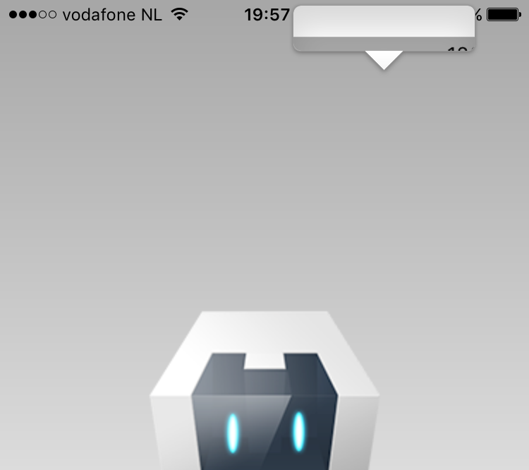

# Cordova iOS LongPress Fix Plugin
by [Eddy Verbruggen](http://twitter.com/eddyverbruggen)


## Description

Apple thought it'd be nice to show a magnifying glass when longpressing the webview on iOS9.

Don't like it? This plugin removes it!




## Installation

Cordova CLI
```
$ cordova plugin add cordova-plugin-ios-longpress-fix
```

PhoneGap Build
```xml
<gap:plugin id="cordova-plugin-ios-longpress-fix" source="npm" />
```


## Usage
It just works, and will proudly shout that at the XCode console when it does.


## Limitations
Currently only works with UIWebView, not WKWebView, but you should be able to
suppress the magnifying glass on WKWebView with a few lines of CSS.


## Future
I'm working with Cordova guys to get this in their distribution as standard.